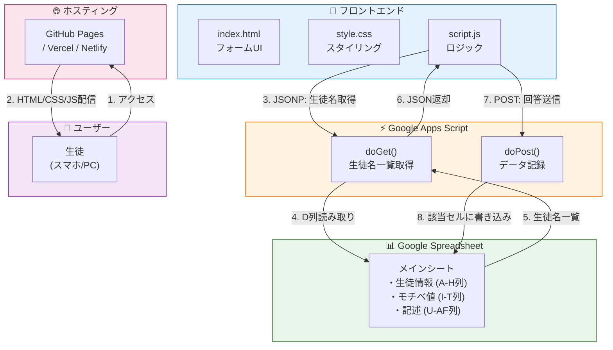

# 英語学習モチベーション調査システム

土浦日本大学中等教育学校の生徒を対象とした、月次英語学習モチベーション調査のためのWebアプリケーションです。

## 概要

生徒がスマートフォンやPCから簡単に回答でき、Google Spreadsheetに自動記録されるシステムです。

### 主な機能

- 📋 **プルダウン式の氏名選択** - 登録済みの生徒名から選択
- 📅 **月選択** - 4月〜翌年3月の12ヶ月分
- 📊 **モチベーション評価** - -2〜+2の5段階評価
- ✏️ **自由記述** - モチベーション変動の要因を記録
- 📱 **レスポンシブ対応** - スマホ・タブレット・PC対応

## システムアーキテクチャ



## ファイル構成

```
📁 AutoEmbedder/
├── 📄 index.html      # フォームUI
├── 📄 style.css       # スタイルシート
├── 📄 script.js       # フロントエンドロジック
├── 📄 README.md       # このファイル
└── 📁 gas/
    └── 📄 Code.gs     # Google Apps Script
```

## スプレッドシート列構成

| 列 | 内容 |
|----|------|
| A | 日大 |
| B | クラス |
| C | 出席番号 |
| D | **氏名** ← キーとして使用 |
| E | 文系理系 |
| F | 英語クラス |
| G | 研究に参加 |
| H | インタビューに参加 |
| I〜T | **モチベーション値** (4月〜3月) |
| U〜AF | **変動要因の記述** (4月〜3月) |

## 技術スタック

| レイヤー | 技術 |
|----------|------|
| フロントエンド | HTML5, CSS3, Vanilla JavaScript |
| バックエンド | Google Apps Script |
| データベース | Google Spreadsheet |
| 通信 | JSONP (GET), Fetch API (POST) |
| ホスティング | GitHub Pages / Vercel / Netlify |

## セットアップ

### 1. Google Spreadsheet

既存のExcelファイルをGoogle Spreadsheetにインポートし、D列に生徒の氏名が入っていることを確認。

### 2. Google Apps Script

1. スプレッドシートで「拡張機能」→「Apps Script」を開く
2. `gas/Code.gs` の内容をコピー＆ペースト
3. `SPREADSHEET_ID` と `MAIN_SHEET_NAME` を設定
4. 「デプロイ」→「新しいデプロイ」→「ウェブアプリ」
5. アクセス権限を「全員」に設定
6. デプロイURLをコピー

### 3. フロントエンド

`script.js` の `GAS_URL` にデプロイURLを設定。

### 4. 公開

GitHub Pages、Vercel、Netlifyなどにデプロイ。

## ライセンス

Copyright © 2025-2026 鈴木絵美理 All Rights Reserved.
